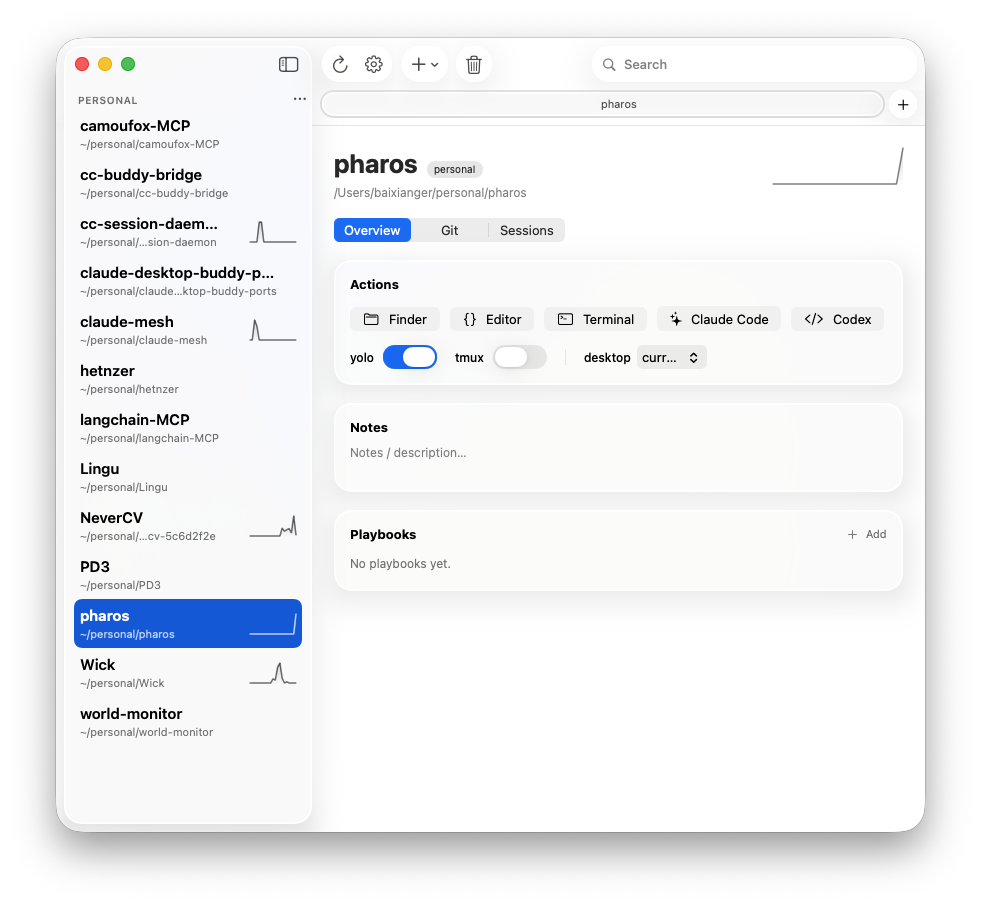

<div align="center">
  
  <h1>Pharos</h1>
  <p><strong>Your vibe coding project manager.</strong></p>
  <p>Mission control for running AI coding agents across all your repos — launch, resume, parallelize, and track agent work at speed.</p>
</div>

<div align="center">

[](LICENSE)
[](https://www.apple.com/macos/)
[](https://swift.org)
[](https://developer.apple.com/design/)
[](https://github.com/baixianger/pharos/pulls)

</div>

---

<div align="center">
  
  <br>
  <sub>One window for every repo and every coding agent.</sub>
</div>

---

## Features

### Organize

**Local and GitHub projects in one registry.** Add a local folder, a GitHub remote URL, or both — Pharos keeps a single unified project list regardless of where code lives.

**Tag groups and a watchlist-style sidebar.** Assign any number of tag-based groups to a project; the sidebar shows each group as a named section, exactly like a stock-app watchlist. Switch between "All Projects" and any group in one click.

**Commit-activity sparklines.** Every row in the project list shows a compact commit-frequency sparkline so you can see which repos have been active without opening them.

**Commit-activity heatmap.** The project detail view surfaces a GitHub-style heatmap of daily commit counts, giving you an at-a-glance history of how heavily a project has been worked.

**GitHub import with multi-select.** Pharos can fetch your GitHub repo list via `gh` and let you checkbox-select multiple repos at once, optionally assigning them to a group on import.

**Per-project notes and description.** Each project has a free-text notes/description field shown in the detail pane — useful for capturing context, links, or the current task for each repo.

### Launch Agents

**One-click launch of Claude Code or Codex.** Pick a project, pick an agent, and Pharos opens your configured terminal and starts the agent in that project's directory. No manual `cd` or command-line invocations required.

**Per-project yolo and tmux defaults.** Toggle yolo mode (passes `--dangerously-skip-permissions` / `--dangerously-bypass-approvals-and-sandbox`) and tmux mode (wraps the agent in a persistent tmux session) per project — set them once, launch fast forever.

**Terminal and editor choice.** Pharos respects your preference: choose Ghostty, macOS Terminal, iTerm, Warp, or WezTerm as your terminal, and VS Code, Cursor, Zed, Xcode, or Sublime Text as your editor. The same preference drives both GUI launches and CLI launches.

**Desktop and Space placement.** Configure which macOS desktop Space agent windows should land on, so your agent never hijacks the wrong Space.

**Per-project playbooks.** Save named shell commands ("run tests", "deploy staging", etc.) as playbooks attached to a project. Run them in one click from the UI or via the `pharos playbook` CLI command.

### Resume and Parallelize

**Browse and resume past sessions.** Pharos indexes `~/.claude/projects/` for Claude Code sessions and `~/.codex/sessions/` for Codex sessions, listing them newest-first per project. Resuming a session is a single click — Pharos opens the right terminal with the correct resume flag.

**Git worktree manager.** Create, list, switch, and delete git worktrees from within Pharos. Each worktree gets its own checkout on a separate branch, so multiple agents can work the same repo in parallel without stepping on each other.

**Running-agent detection and attach.** Pharos detects active agent processes and lets you attach to an existing session rather than launching a duplicate.

### Cockpit

**⌘K command palette.** A fuzzy-search palette lets you jump to any project, trigger any quick action (launch, open terminal, open editor, reveal in Finder), or jump straight to an issue (by number, title, or label) from the keyboard, anywhere in the app.

**Menu-bar quick launch.** The Pharos menu-bar item shows a per-project submenu, letting you launch an agent or open a terminal without switching to the main window.

**Native macOS window tabs.** Pharos uses standard macOS tab bars — open one tab per project and switch between them like browser tabs, without losing your place in any project's detail view.

**Agent-finish notifications.** macOS notifications fire when a watched agent process exits, so you know when a long-running task is done without polling.

**Issues, list or board.** Per project, track issues (status, priority, freeform labels) as a filterable list or a drag-to-reorder **kanban board** grouped by status. The headline trick: launch an agent *on* an issue and Pharos auto-logs an update to the project log when it finishes.

**Recent activity feed.** A cross-project view (toolbar → Activity) of all recent issues and project-log updates, newest first — click any entry to jump straight to it.

### Git and Multi-Machine

**Per-project git panel.** The project detail view shows current branch, dirty/clean status, commits ahead and behind the remote, and the most recent commit — pulled live via git.

**Open PRs and CI status.** For GitHub-backed projects, Pharos uses `gh` to surface the count of open pull requests and the conclusion of the latest CI run (success, failure, in progress) alongside the local git state.

**Peer git drift over SSH.** Configure a peer host (another Mac) in Settings, and Pharos will SSH into it to compare each project's HEAD, branch, and dirty count against your local copy — useful for keeping two machines in sync. Per-project, you can override the remote directory path if it differs from your local one.

---

## Install

### Download (recommended)

1. Grab the latest **`Pharos-<version>.dmg`** from [Releases](https://github.com/baixianger/pharos/releases).
2. Open the DMG and drag **Pharos.app** to your Applications folder.
3. Launch. Pharos is notarized and Developer ID–signed — no Gatekeeper warning.

> **Requirements:** macOS 26 (Tahoe) · Apple Silicon (arm64) or Intel (x86_64 universal binary)

Pharos uses **Sparkle** for automatic updates — you'll be notified inside the app when a new version is available.

### Build from Source

```bash
git clone https://github.com/baixianger/pharos.git
cd pharos
swift build                  # compile-check
bash Scripts/dev.sh          # build icon + package Pharos.app + launch
```

No Xcode project required — Pharos is a pure SwiftPM app.

---

## CLI — how agents drive Pharos

Pharos is scriptable from the command line, and the CLI is the interface coding
agents use: a Claude Code or Codex session can shell out to `pharos` to read
project state, manage issues, and post progress — no separate server to run, and
nothing preloaded into the agent's context. The CLI ships **inside the app
bundle** — the binary at `Pharos.app/Contents/MacOS/Pharos` *is* the CLI; symlink
it onto your `PATH` as `pharos`:

```bash
ln -s /Applications/Pharos.app/Contents/MacOS/Pharos /usr/local/bin/pharos
pharos help                              # discover every command
pharos list --json                       # machine-readable project list
pharos launch myrepo claude --tmux       # launch an agent
pharos issue add myrepo "Fix login bug" --priority high
pharos issue start myrepo 3 claude       # launch an agent ON issue #3
pharos update add myrepo "shipped the fix" --issue 3
pharos remove myrepo                     # reversible — see `pharos trash`
```

Every read command accepts `--json`. Deletes (`remove`, `group delete`,
`issue rm`) are reversible via the Trash for 30 days. Set
`PHAROS_REGISTRY=/path/to/projects.json` to target an alternate store. The GUI
live-reloads within ~2 seconds whenever the CLI writes, so changes show up in the
running app immediately.

### Command reference

Run `pharos help` for the authoritative list. Summary:

| Group | Commands |
|-------|----------|
| Read | `list` · `groups` · `git <project>` · `worktrees <project>` · `sessions <project> <agent>` · `issue list <project> [--all]` · `update list <project>` · `trash [list]` |
| Agents | `launch <project> <agent> [--no-yolo] [--tmux]` · `resume <project> <agent> <session_id>` · `playbook <project> <name>` · `open`/`editor`/`reveal <project>` |
| Issues & log | `issue add <project> "<title>" [--priority …] [--body …] [--attach <file>]… [--label L]…` · `issue list <project> [--all] [--status S] [--priority P] [--label L]` · `issue status\|priority <project> <#> <value>` · `issue label add\|rm <project> <#> <label>` · `issue start <project> <#> <agent>` · `issue rm <project> <#>` · `attach add\|list\|rm <project> <#> …` · `update add <project> "<text>" [--issue <#>]` |
| Registry | `add <name> [--path] [--remote] [--tag]… [--notes]` · `remove <project>` · `rename <project> <new>` · `describe <project> <text…>` · `group create\|delete\|add\|remove …` · `yolo`/`tmux <project> <on\|off>` · `trash restore <id>` · `trash empty` |
| Multi-machine | `host` · `path <project> <path>` · `path <project> --clear` |

The headline differentiator — **issues wired to the agent loop**: `pharos issue
start` moves an issue to *In Progress* and links the agent session; when that
agent finishes (tmux), Pharos auto-posts an update to the project log. Agents can
also post their own progress with `pharos update add`.

## Multi-machine sync (iCloud)

Settings → **Data location** can move Pharos's data into **iCloud Drive**, so
your projects, issues, and logs sync across your Macs (plain iCloud Drive — no
entitlement, works with any signing). The catch iCloud alone can't solve: a
project's local checkout path differs per machine (`~/dev/x` vs `~/personal/x`).
Pharos handles it with a **per-host path map** — each Mac stores and reads only
its own path (keyed by computer name), so syncing never clobbers it. A project
synced from another Mac shows "not checked out on *this* host" until you point it
at a local folder (GUI **Set local folder…**, or `pharos path <project> <path>`).
`pharos host` prints this machine's key. Set **Peer host key** (Settings) to the
other Mac's key and the SSH peer-drift comparison reads its path from the synced
map automatically.

---

## Privacy

Pharos reads `~/.claude/projects/` and `~/.codex/sessions/` **locally only**. No session data, file paths, or identifiers are transmitted to any remote server. All app state lives in `~/Library/Application Support/Pharos/`.

---

## Release

Pharos is distributed as a notarized DMG, built and published with one command:

```bash
bundle exec fastlane mac release
```

This runs the full pipeline: build → sign → notarize → staple → DMG → GitHub release. See [docs/RELEASE.md](docs/RELEASE.md) for prerequisites (Developer ID cert + notarytool profile).

---

## Contributing

PRs are welcome. The project uses **pure SwiftPM** — no `.xcodeproj`, no CocoaPods.

```bash
git clone https://github.com/baixianger/pharos.git
cd pharos
swift build          # compile
swift test           # run the 22-test suite
bash Scripts/dev.sh  # build + launch locally
```

A few things to keep in mind:

- Pharos targets **macOS 26** and uses Liquid Glass APIs not available on earlier OS versions.
- Keep the SwiftPM build green (`swift build` + `swift test`) — CI runs this on every PR.
- Match the existing code style (Swift 6 strict concurrency where possible; Sparkle's MainActor isolation is a known exception, documented in the codebase).
- For significant changes, open an issue first to discuss the approach.

---

## License

[MIT](LICENSE) © 2026 Pai
